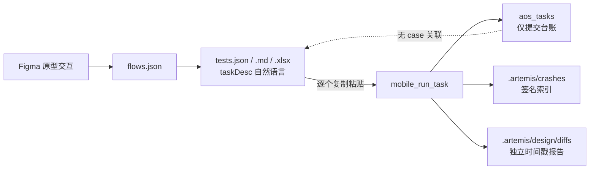
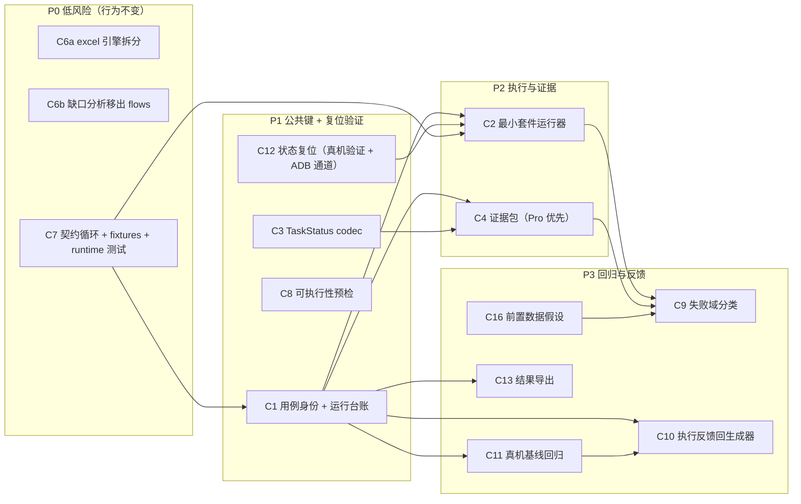

# 测试闭环深化分析（头脑风暴 + 证据核验）

> 生成日期：2026-10-01
> 范围：Figma 设计上下文 → 测试生成 → 真机执行 → 失败取证 → 设计/真机对比 全链路，以及仓库自身测试面
> 方法：先用三条检验核验每条主张，再用多视角发散生成新候选；发散部分采用 council 式多声部结构（支持 / 最强反驳 / 成立条件 / 证伪条件）。本工作区没有名为 brainstorm 的技能，此为最接近的等价展开。

---

## 0. 判定标准与术语

每条候选必须通过三关：

1. **摩擦真实**：代码可指认（`file:line`），不是推测。
2. **深化检验**：deletion test——删掉它会消散复杂度，还是把复杂度扩散到 N 个调用方；depth = 小 interface 后藏大量行为，不是行数比。
3. **约束检验**：`mobile_*` schema 原样透传（AGENTS.md，`src/server.ts:591` 逐字转发）；ADR-0001（判定/解释分离）、ADR-0003（失败步骤走上游工具，不读 `data_engine.db`）、ADR-0004（diff 只读 screen-map）；各 spec 的 Out of Scope 边界。

术语：module / interface / depth / seam / adapter / leverage / locality。

---

## 1. 现状：一条停在一半的流水线

### 四个机械循环（均已代码核实）

| 循环 | 事实 | 证据 |
|---|---|---|
| 1 生成 → 执行 | 用例无稳定 id；人工逐条复制 `taskDesc`；台账只存文本描述 | `src/figma/test-gen.ts:14-20,139-145`；`README.md:140`；`src/db/types.ts:23-33`；`src/db/postgres.ts:45-55` |
| 2 失败 → 取证 | 需人工串联 4-5 个工具；只取第一个失败项；证据截断 160 字符且不落盘；Flash 没有失败证据 | `src/diff/device-source.ts:64-76,94-134`（`:113` 自认 Flash 无 `run_outcome`） |
| 3 对比 → 回归 | 每次 diff 独立目录；`src/` 无任何代码读取 diffs 目录 | 全仓 grep 仅命中 `src/server.ts:168` 工具描述与 `src/diff/tool.ts:351-371` 写盘点 |
| 4 仓库自测 | 最大 module 最缺专属测试；契约只验 1/5 | `src/runtime.ts` 972 行无 `runtime.test.js`；`sweepStaleChild`（`src/runtime.ts:948`）被 `src/server.ts:673`/`src/http-server.ts:128` 调用但测试零引用；`test/proxy.test.js:44-50` 只 deepEqual 了 `mobile_diagnose` 一个 schema |

补充事实（数值勘误）：当前实测 **321 个用例**、约 1.6s；`AGENTS.md:9` 的 "256+"、`DESIGN.md:451` 的 "307" 均已过期。

---

## 2. 原始 7 条候选的论证结论

| # | 候选 | 判定 | 一句话理由 |
|---|---|---|---|
| C3 | 任务结果类型化接缝 | **成立（最强）** | 4 个重复解析器 + 真实双 adapter，deletion test 通过 |
| C1 | 用例身份与运行台账 | **成立（前置键，非深度本身）** | 三存储无公共键；不能改 mobile schema，id 走 server 侧 taskDesc hash join（零 prompt 改动） |
| C7 | 仓库测试面 | **成立（精度收益，非速度）** | 删 `sweepStaleChild` 不会红；契约缺口 4/5 |
| C6 | 用例 IR 与生成器拆分 | **部分成立**：拆分成立；IR 待消费者；i18n"key 优先"论断撤回 | ARTEMIS 视觉定位，resource key 进自然语言 taskDesc 无约束力（与 `DESIGN.md:514` 的承诺存在模型表达力落差） |
| C4 | 失败证据聚合 | **成立但仅 Pro 场景** | 证据链真实存在，但 Flash 无 check items；ADR-0003 已自动锚步骤，增量有限 |
| C2 | 套件编排 | **成立但体量最大** | 摩擦真实（runner 零存在），但需处理设备 FIFO/并发/续跑，且与"执行归客户端"存在边界张力 |
| C5 | 差异签名与基线 | **降级 Speculative** | spec 明确 Out of Scope；当前无消费者，属为假想回归工作流投资 |

### 逐条关键证据与最强反驳

**C3 成立。** 重复解析器：`src/runtime.ts:916`（被 `:642`/`:883` 调用）、`src/server.ts:476`（extractTraceId）、`src/diff/device-source.ts:51`（parsePayload）、`src/tools/composite.ts:24`（extractDeviceImage）。`ArtemisProxyLike`（`src/artemis/proxy.ts:27-36`）已注入，`StubProxy` 是第二个 adapter，seam 真实。**勘误：该接口只有 8 个方法，此前报告写的"9 个直通方法"有误；`withArtifactMirror`（`src/runtime.ts:146-161`）手动重列的是同样 8 个。** 最强反驳：纯内部重构，对终端用户可感知的机械循环改善最小；本质是 C1/C4 的使能器。

**C1 成立（有前提）。** 全仓 `caseId` 零命中；`GeneratedTest` 无 id；`recordTaskSubmission` 只写 `submitted`（`src/runtime.ts:496-520`）；`tests.json` 无读者（仅有写点 `src/figma/test-gen.ts:408`）。附带三个真实缺陷：`isError` 提交完全不记录（`src/server.ts:592`）；traceId 可能为 `"unknown"` 永不收敛（`:593-596`）；`profile` 与 `model` 同值（`:597-598`）。最强反驳：没有 module 可删，deletion test 不适用——收益是 leverage 而非 depth。修正条件（已定，P1 同批修）：**不改 prompt、不加字段**。AOS server 提交时同时持有完整 `task_desc` 与返回的 `trace_id`（`src/server.ts:591-602`），直接对 `tests.json` 的 `taskDesc` 做精确 hash join，台账记录 `{traceId → caseId}`；运行器发起时天然知道 caseId。已否决：正文内嵌机器 ID（污染 LLM 上下文）、ARTEMIS metadata 字段（不存在，且透传约束禁止新增）、`<!-- aos_meta -->` 注释块（对 LLM 仍是纯文本）。生成器可追加 `id` 仅作外部映射（`test/figma-testgen.test.js` 只断言具体字段，不破坏测试）。上述三个台账缺陷（`isError` 不记录 / `unknown` 永不收敛 / model=profile）与 C1 同批修。

**C7 成立（重新定位）。** 证据见上表。最强反驳：321 用例 1.6s，全量成本极低——若以"少跑测试"为卖点会失败；正确卖点是"删掉一个分支能被发现"与契约完整性。补充：`package.json:22` lint 仅覆盖 `src`，测试 JS 既不 lint 也不 typecheck。

**C6 部分成立。** 可立即成立的拆分：ExcelJS 引擎独立（`src/figma/test-gen.ts:170-332`）、缺口分析移出 `src/figma/flows.ts:255-588`、`maxDepth` 暴露或如实报告截断（`:29,46,78`）。IR 的价值取决于后续消费者（C1/C2/C4）。撤回的论断：`DESIGN.md:514` 的"testID/资源 key 优先"在当前"自然语言 taskDesc + 视觉定位"执行模型下无法兑现；实现成注释（`test-gen.ts:98-101`）是合理近似，要兑现需生成代码级测试，超出当前范围。

**C4 成立但受限。** `failed_items[0]`（`device-source.ts:69`）、160 字符截断（`:74`）、证据不落报告均已核实；Flash 无失败证据是错误文案自认（`:113`）。最强反驳：ADR-0003 已让 `design_device_diff` 自动锚定失败步骤，人工串联只剩 crash 与多次失败项——增量小于报告观感。补充约束（体积）：默认只复制失败步骤 ±1 步的截图 + 其余步骤存路径 manifest，`full_trace` 开关按需；截图取自上游落盘文件（`src/diff/device-source.ts:163-178`），复制是可选动作而非必然。

**C2 成立但最重。** 无 runner（grep 零命中）；`scripts/design-pipeline.mjs:100` 以"下一步用 mobile_run_task 执行"收尾。最强反驳：上游 `artemis/mcp_server/rules.md` 本就建议"探索一次后写确定性脚本"，AOS 内建 runner 与"执行是客户端职责"存在职责张力；必须最小切片（顺序执行 + 轮询 + 报告），多设备并行不做。

**C5 降级。** diffs 目录无读取方；spec 将 CI 门禁/自动触发/多步骤序列对比列为 Out of Scope。**但发散后出现更好的替代形态，见 C11。**

---

## 3. 发散：五个视角与新候选

### 视角 A · 目标模型：测试的"目标"目前不可表达

今天一个用例是"线性化路径 + 中文散文步骤 + 目的地文本断言"，没有机器可读的断言与覆盖概念。由此产生的机械性：人只能重复跑整条用例来验证一个点。

**C8 · 用例可执行性预检 + 覆盖视图**（价值高 / 成本低）
- 主张：执行前静态检查 `tests.json`：无断言步骤（`assertionFor` 可为空，`src/figma/test-gen.ts:81-86`）、入口屏回退到全部屏幕（`:38-41`）、截断与深度上限（`:29,46,78`）、死端/不可达屏幕；输出"未覆盖屏幕/边"清单。
- 证据：截断与回退均为沉默行为，调用方无法区分"只有 10 条"与"被截到 10 条"。
- 反驳：预检不能替代真实执行，价值取决于有多少弱用例实际存在（需先用现有图统计）。
- 成立条件：先输出报告不改行为；证伪条件：若真实 Figma 文件生成的用例几乎都有断言，收益下降。

**C9 · 失败域分类（应用缺陷 / 用例缺陷 / 环境问题）**（价值高 / 成本中）
- 主张：基于已有确定性产物做分类：crash 签名（`kind: java/native/anr`，`src/crash/types.ts:25-43`）→ 应用缺陷；设备离线/adb 错误 → 环境；无 crash 但断言不符 → 行为/设计差异；任务 stalled → 用例或脚本问题。
- 证据：这些信号今天都单独存在（crash store、`status.json.error`、`failed_items[].kind`），只是没人合并判断。
- 反驳：分类边界可能模糊，需保持确定性规则；涉及解释时应留在模型层（CONTEXT.md 判定/解释分层）。
- 成立条件：规则先行、低置信度不分类；证伪条件：真实失败样本分类准确率低于人工直接读 raw 错误。

### 视角 B · 证据链：让 case → trace → 证据 → 回归成为一条链

**C1 + C3 + C4 的组合是主干**（见第 4 节依赖图）。在此之上：

**C11 · 真机基线视觉回归（替代原始 C5）**（价值高 / 成本中；P3，不阻塞 P1）
- 主张：基线不是"上一次 diff 报告"，而是"上一次通过用例的步骤截图"（last-known-good）。新运行按屏幕/步骤与基线做设备对设备 diff，检出"本来好、现在坏"的回归；Figma 设计差异只作为另一条独立信号（设计 diff 不取消）。
- 证据：步骤截图已存在（`mobile_inspect_trace` / `view_step_screenshots`，`src/diff/device-source.ts:141-179`）；diff 引擎与判定已是确定性纯函数（`src/diff/engine.ts`）；缺的只是基线与签名（`src/` 对 diffs 目录零读取）。
- 元数据契约（补充规格）：`{image, deviceSerial, screenSize, dpi, ignoreRegions[], capturedAt, caseId}`，按设备与屏幕分桶存储（如 `.artemis/design/baselines/<serial>/<screen>/`）；当前设备分辨率/DPI 与基线不符时**直接不比对**（记 `unmapped`），不做无意义 diff。
- 噪声边界：沿用现有能力——`ignoreRegions`、`insets`、降采样、`suspected:"system-area"` 降级（`src/diff/engine.ts`）；基线只对"通过用例的关键屏幕"建立。噪声导致的是信号质量下降，不是核心功能阻塞。
- 反驳：动态内容（视频、时钟、轮播）与设备分辨率差异会让基线噪声大；用户可能更关心"与设计稿一致"而不是"与上次一致"。
- 成立条件：先只对"通过用例的关键屏幕"打基线；证伪条件：真实噪声率高于人工复核成本。

**C13 · 运行报告导出（xlsx 回填 / JUnit）**（价值中 / 成本低）
- 主张：把逐用例 pass/fail/耗时/证据路径回填 `tests.xlsx`（当前 spec 明确排除，`.scratch/test-excel-export/spec.md:63-65`），并输出 CI 友好的 JUnit XML；复用 C1 台账。
- 证据：Excel 模版机制已存在（`src/figma/test-gen.ts:170-332`），只是没有"结果列"。
- 反驳：回填改变现有产物语义；`tests.xlsx` 从"生成物"变"运行产物"，需要新契约。
- 成立条件：作为独立运行报告文件而非覆盖 tests.xlsx；证伪条件：用户在 IDE 对话里即可看结果，不需要文件。

### 视角 C · 执行：机械重跑的三个根因

**C12 · 用例间状态复位**（价值高 / 成本低；已升级为 **P1 前置验证**）
- 主张：用例假设"开始前停在 X 页"（`src/figma/test-gen.ts:141`），连续跑时前一条的残留状态会造成失败噪声。运行器应在每例前做确定性复位。
- 已核实（上游语义）：`_handle_initial_app_launch` 在 app **已在前台时不重启**（`artemis/artemis/utils/app_launch_utils.py:369-378`）；不在前台才 `monkey -c LAUNCHER 1`（`artemis/artemis/drivers/android/adb_driver.py:385-392`）；`am force-stop` 仅在启动重试失败时出现（`app_launch_utils.py:299-305`）。`locked_app_package` 只保证 app 在前台，**不保证回到入口屏**。
- 修法（确定性，不依赖上游改动）：AOS 已有 ADB 通道（崩溃取证 `src/crash/collect.ts`、`AOS_ADB_PATH`），runner 每例前执行 `adb shell am force-stop <pkg>` + `monkey -p <pkg> -c android.intent.category.LAUNCHER 1`（与上游同款命令）；无 adb / 云真机部署降级为"不复位并在报告标注"。入口导航可选消费 `suggestedRoute`（`src/figma/flows.ts:22-50`，当前无人消费）。
- 已否决的修法：`mobile_manage_task inject_instruction` 是 mid-flight 的自然语言引导（上游 `mcp_server/tools/task_manager.py:242-247,569-609`），不是确定性脚本，也无法在任务开始前注入。
- 严重度校准：不是"第一条之后全部失败"——taskDesc 自带导航指令（`src/figma/test-gen.ts:141`），独立 agent 会话多数可自行返回；影响是成功率与 token 不稳定，随 Flash/Pro 与页面深度变化。
- 成立条件：一次真机验证即可定论；证伪条件：实测 `monkey` 启动总能落到入口且弹窗可被 agent 稳定恢复。

**C2 最小切片 + C14 失败定向修复**（价值中 / 成本高、风险高，建议暂缓）
- C14 主张：失败后用 `mobile_manage_task(action="inject_instruction")`（上游支持，AOS 从不调用——全仓只以 `action:"status"` 调用）做一次定向修正，或 `replay_steps` 重放失败段。
- 反驳：模型在环的自动修复不可复现，与"确定性判定"哲学冲突；rules.md 明确"精确时序在最终代码里实现"，不靠 LLM 补偿。
- 成立条件：限定为"单次、可审计、失败即停"；证伪条件：修复成功率低于人工重跑。

**C15 · 模型路由建议**（价值低 / 成本低）
- 按用例步数/分支数建议 Flash vs Pro（rules.md 已有选择标准），仅建议不强制。

**C16 · 测试前置数据假设的显式化**（价值中 / 成本低）
- 主张：E2E 用例往往隐含数据前提（已登录、列表有 5 条、购物车非空）；环境不符会被误判为应用缺陷。AOS 当前无数据注入能力，短期至少在生成物与失败分类中显式标注"前置数据假设"，长期再评估注入机制。
- 证据：`taskDesc` 没有任何数据前提声明（`src/figma/test-gen.ts:139-145`）；C9 缺"数据环境不符"子类。
- 成立条件：随 C9/C10 落地为分类子类与生成提示；证伪条件：目标用例均不依赖可变数据。

### 视角 D · 回报：用户看到的应是"目标达成度"

**C8（覆盖视图）+ C9（失败域）+ C13（报告）共同构成"运行报告"这一产品面**：逐用例结果、未覆盖面积、失败分类、证据链接、与上次的差异。它才是"协助测试完成目标"的界面，而不是散落的 trace/文件路径。

### 视角 E · 仓库自身（C7 的展开）

- 契约测试循环：5 个 mobile schema 全部逐字节对比（现状 1/5）。
- `runtime.test.js`：`sweepStaleChild`、状态同步、关停、子进程装配（现状仅 `test/llm-tools.test.js:287` 触及 `prepareChildSpec`）。
- fixture 去重：logcat `fmt` ×3、Figma 合成文档 ×2、pen fake ×4（详见前期测试面报告）。
- 聚焦脚本 + 覆盖率：`test:only` 已存在但会跑 stale dist；补 `test:file` 与 c8。
- 不改 `AGENTS.md` 的完工标准（全量绿仍是门槛）——C7 的定位是提高信号精度，不是减少测试量。

---

## 4. 依赖图与分期

- **P0**：纯搬运，不改行为，立即能做（改动被既有测试约束住的地方要先解冻——`test/figma-testgen.test.js:181-197` 锁了 xlsx 布局）。
- **P1**：C1 是全局键（含三个台账数据质量缺陷同批修）；C3 取最小形态（先统一 `extractJson/parsePayload/extractTraceId` 一个 codec，不急着合并 mirror）；C12 先做一次真机验证（复位策略是 C2 可靠性的前提）。
- **P2**：C2 只做顺序执行 + 轮询 + 落报告；C4 先生成证据包与降级规则（Flash 明示"无失败证据"、默认只复制失败步骤 ±1）。
- **P3**：C11 先打"通过用例关键屏幕"的基线；C10 是真正的闭环（执行结果反哺生成质量），但必须建立在 C1/C2 的可信数据上；C16 随 C9 落地。

**C10 · 执行反馈回生成器**（价值最高 / 依赖最重）：哪些屏幕的任务总是失败 → 提示词/hint 不足以定位元素；哪些断言总是无法验证 → 回退到别的验证方式。没有 C1/C2 时这只是愿望；有了台账后它只是一个读取 + 建议模块。

---

## 5. 优先级矩阵

| 候选 | 用户价值 | 成本 | 风险 | 前置 | 建议 |
|---|---|---|---|---|---|
| C1 用例身份台账 | 高（解锁一切） | 低 | 低 | 无 | **先做** |
| C3 类型化接缝（最小） | 中（内部一致性） | 低中 | 低 | 无 | **先做** |
| C7 仓库测试面 | 中（精度） | 中 | 低 | 无 | **先做** |
| C6a/C6b 拆分 | 中（locality） | 低 | 低 | 无 | **先做** |
| C8 可执行性预检 | 高（防机械空跑） | 低 | 低 | 无 | 紧随 P1 |
| C2 最小运行器 | 高 | 中高 | 中 | C1 | 分期 |
| C4 证据包 | 中高（限 Pro） | 中 | 低 | C1/C3 | 分期 |
| C11 真机基线回归 | 高 | 中 | 中（噪声） | C1 | 待真实回归样本 |
| C13 结果导出 | 中 | 低 | 低 | C1 | 可并行 |
| C12 状态复位 | 高 | 低（ADB 通道已有） | 中 | 无（P1 真机验证） | **P1 前置** |
| C9 失败域分类 | 中高 | 中 | 中（误分类） | C1/C4 | 规则先行 |
| C16 前置数据假设 | 中 | 低 | 低 | C9/C10 | 随 C9 落地 |
| C10 生成反馈 | 最高（真正闭环） | 中 | 中 | C1/C2/C11 | P3 |
| C5 原始形态 | 低 | 中 | 低 | — | 暂缓 |
| C14 失败定向修复 | 中 | 高 | 高 | C2 | 暂缓/试点 |

---

## 6. 反候选（明确不做或暂缓）

1. **CI 门禁 / 自动触发**：spec 明确 Out of Scope，且在 C1/C11 落地前没有可靠数据源。
2. **通用步骤 IR（无消费者版）**：等 C2/C4/C10 出现真实消费者再立项，否则是 YAGNI。
3. **多设备并行编排**：上游已保证 per-device FIFO，AOS 再包一层调度的收益与复杂度不成比例。
4. **LLM 参与差异判定**：违反 ADR-0001 与 CONTEXT.md 分层（判定确定性、模型只解释）。
5. **向应用源码注入 testID**：范围外，且依赖被测试项目改造。
6. **改 `AGENTS.md` 的全量测试门槛**：门槛是流程决策，不是架构收益。
7. **向 taskDesc 正文内嵌机器 ID**：污染 LLM 上下文，且没有可靠的"忽略"机制；改用 server 侧 taskDesc hash join（见 C1）。

---

## 7. 待决策问题（进入 grilling 的输入）

1. 测试主体是谁：IDE 里的 agent、CI、还是人？主要目标是设计走查、功能回归、还是发版验收？
2. 一轮典型跑几条用例？Flash 与 Pro 的比例？（决定 C4 的真实价值）
3. 允许新增原生 MCP 工具（如 `mobile_run_suite`），还是只接受 CLI 脚本？（已决 2026-10-02：CLI 子命令 `node dist/cli.js suite …`，见票据 14 与 DESIGN §13.33）
4. `caseId` 载体：默认 server 侧 taskDesc hash join（零 prompt 改动）；人工改写过的 taskDesc 是否接受回退为文本近似？
5. 结果报告消费端：IDE 对话、xlsx、还是 CI 产物？（决定 C13 形态）
6. 回归基线用设计稿（Figma/pen）还是"上次通过的真机快照"？（C11 的方向）
7. 用例间状态复位：是否允许 runner 直接走 ADB（force-stop + monkey）？云真机/无 adb 部署如何降级？
8. 是否接受"证据包不含 LLM 解释"（只堆确定性的 crash/失败项/截图/锚点）？证据包默认只含失败步骤 ±1 的图片副本是否可以？
9. E2E 是否需要前置数据准备机制（登录态、列表数据）？短期是否只做"前置数据假设"显式标注？

---

## 附录 A · 勘误与修正记录

| 位置 | 原表述 | 修正 |
|---|---|---|
| 此前 HTML 报告 C3 | "ArtemisProxy 9 个直通方法" | 实为 **8 个**（`src/artemis/proxy.ts:27-36`）；`withArtifactMirror` 重列同为 8 个（`src/runtime.ts:146-161`） |
| 此前报告 C5 评级 | Worth exploring | **Speculative**（spec Out of Scope 且无消费者；由 C11 替代其价值） |
| 此前报告 C6 的 i18n 论断 | "key 只是注释，是定位能力欠债" | **撤回**：视觉定位模型下无法兑现，需代码级测试才有意义 |
| 测试数量 | "256+ / 307 用例" | 实测 **321 个用例、约 1.6s** |
| C7 卖点 | "减少全量跑的成本" | 修正为**提高信号精度**（1.6s 的全量并不贵） |

## 附录 B · 已核实证据索引

- 生成与用例：`src/figma/test-gen.ts:14-20`（无 id）、`:24-79`（截断/深度）、`:81-86`（可空断言）、`:98-101`（i18n 注释）、`:139-145`（taskDesc）、`:170-332`（ExcelJS）、`:408`（写 tests.json）
- 流程与路由：`src/figma/flows.ts:22-50`（`suggestedRoute` 未被消费）、`:245`（写 flows.json）、`:255-588`（缺口逻辑）
- 存储与任务：`src/db/types.ts:23-33,64-71`；`src/db/postgres.ts:45-55`；`src/runtime.ts:496-520`（提交台账）、`:525-546`（同步）、`:571-583`（崩溃入队）、`:948`（`sweepStaleChild`）
- 代理与解析：`src/artemis/proxy.ts:27-36`；`src/server.ts:476-496`（traceId）、`:576-604`（门禁与记录）、`:591`（逐字透传）；`src/runtime.ts:916`；`src/diff/device-source.ts:51-76,94-134`；`src/tools/composite.ts:24`
- 约束与文档：`AGENTS.md`（schema 透传）；`docs/adr/0001..0004`；`.scratch/test-excel-export/spec.md:63-65`；`.scratch/design-device-diff/spec.md`（Out of Scope）；`DESIGN.md:514`（key 优先承诺）、`:423-434`（测试策略）、`:451`（过期计数）
- 测试面：`test/proxy.test.js:44-50`（契约 1/5）；`test/figma-testgen.test.js:164-165`（i18n 注释被锁）；`test/llm-tools.test.js:287`（唯一触及 `prepareChildSpec`）；`package.json:19-25`（脚本、lint 范围）

## 附录 C · 外部反馈核验记录（2026-10-01）

| 反馈项 | 判定 | 依据与处置 |
|---|---|---|
| C12 状态复位是 P2 生死线 | **核心成立，严重度与修法修正** | 上游已核实"前台不重启"（`artemis/artemis/utils/app_launch_utils.py:369-378`）；但非"第一条之后全失败"；反馈提出的 `inject_instruction` 是 mid-flight 自然语言引导（`mcp_server/tools/task_manager.py:242-247,569-609`），已否决；改用 ADB 确定性复位；升级为 P1 前置验证 |
| C11 基线噪声/存储未定义 | **建议成立，定位修正** | 文档已点出噪声与归一化需求；补充元数据契约与"分辨率不符不比对"；C11 在 P3，不阻塞 P1 |
| ID 内嵌 taskDesc 有污染风险 | **方向成立，备选不可行** | `mobile_run_task` 无 metadata 字段且透传约束禁止新增；`<!-- aos_meta -->` 对 LLM 仍是纯文本；改用 server 侧 taskDesc hash join |
| M1 测试数据前提缺失 | **成立** | 新增 C16 与待决策问题 9 |
| M2 证据包体积 | **成立** | C4 增加"默认只复制失败步骤 ±1 + manifest + `full_trace` 开关" |
| 反馈赞美"C11 彻底解决噪声灾难" | **表述不准确** | C11 只是把设计差异噪声换成动态内容噪声（反馈自身 C2 点也承认）；设计 vs 真机 diff 仍保留 |
